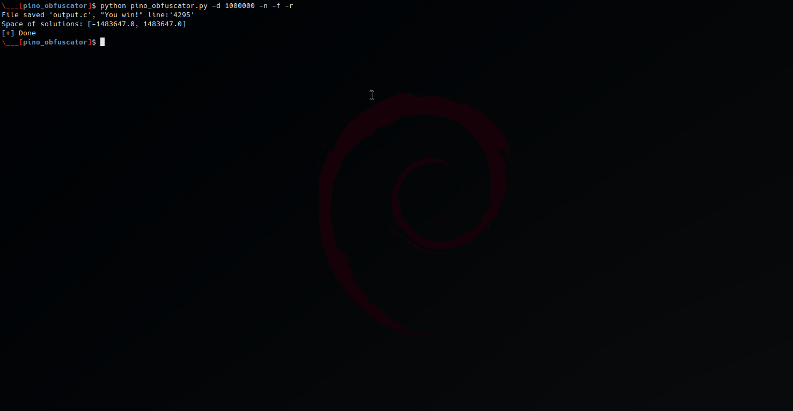

# pino_obfuscator

Simple code obfuscator that i've coded just for fun. It generates if-nested blocks that will pass all if the number given in input is inside the space of solutions.


<br />

 - Example of output generated: 

```c
      #include <stdio.h>
      
      int main(int argc){
      
        char buff[32] = {0};
        double i;
        fgets(buff, 32, stdin);
        sscanf(buff, "%lf", &i);
        
        // paste from here the obfuscated code
          if (i < 344483647.1337){
    if (i > -1634483647.1337){
      if (i < 476483647.1337){
        if (i > -750483647.1337){
          if (i > -563483647.1337){

            [...]
 
              if (i < 1222483647.1337){
                puts("You win!");
              }

            [...]
```


<br />

 - Usage:

```
usage: pino_obfuscator [-h] [-d DELTA] [-s SOLUTIONS] [-n] [-w WRITE_INTO] [-r] [-f]

The script combines multiple IFs in order to add a sort of code obfuscation. To solve all the innested IFs a user should insert a valid number that is inside the solution space and that will pass
each IF.

options:
  -h, --help            show this help message and exit
  -d DELTA, --delta DELTA
                        This value is used to increase or decrease the space of solutions (default: 8000000, [1, ...])
  -s SOLUTIONS, --solutions SOLUTIONS
                        Define the space of solutions by the number of bits. (defualt:32, max:64)
  -n, --negative        Use signed numbers (default:false)
  -w WRITE_INTO, --write_into WRITE_INTO
                        Output (default:'output.c')
  -r, --randomize       Randomize IF blocks positions
  -f, --float           Use floating numbers instead of integers (default:false)

```

<br />

 - Example:




